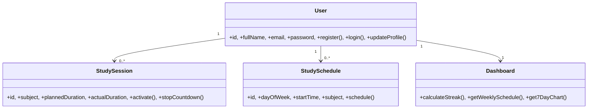

# StudyTrack - Hướng dẫn Dự án

Chào mừng bạn đến với StudyTrack, một ứng dụng web quản lý thói quen học tập. Dự án này sử dụng kiến trúc "Thành phần tệp đơn" (Single-file Component), trong đó giao diện (UI), định dạng (styling) và logic xử lý chủ yếu nằm trong tệp `index.html`.

> **Lưu ý — dự án đang hoạt động nằm ở đâu:** phần tài liệu single-file chi tiết bên dưới giờ mô tả **app cũ trong `legacy/`** (`legacy/index.html`), giữ lại để tham khảo. Dự án đang hoạt động là **monorepo full-stack** (`backend/` FastAPI + Postgres, `frontend/` React/Vite, `deploy/`). Để xem kiến trúc hiện tại, lệnh chạy và quy trình Git/deploy, hãy bắt đầu từ `README.md` ở thư mục gốc, mục `## Harness: StudyTrack refactor` trong `CLAUDE.md`, và `make dev` / `make help`. Hướng dẫn single-file bên dưới vẫn đúng cho `legacy/` nhưng không mô tả stack mới.
>
> **Tiến độ:** Phase 0 (scaffold) và **Phase 1 (auth + nền user: JWT+argon2, User/Profile, thẻ SV ảo, đồng bộ `lang`/`theme` qua server)** đã hoàn thành. Chi tiết kiến trúc auth as-built: xem `README.md` (mục "Xác thực & API") và `CLAUDE.md` (mục "Active stack — Phase 1").

## Tổng quan Dự án

- **Mục đích**: Một công cụ tăng năng suất cho học sinh, sinh viên để quản lý các phiên học, theo dõi tiến độ qua bảng điều khiển (dashboard) và duy trì chuỗi ngày học tập (streaks).
- **Công nghệ cốt lõi**:
  - **HTML5/CSS3**: Triển khai thuần (vanilla) với Biến CSS (CSS Variables) để hỗ trợ thay đổi giao diện (theme).
  - **JavaScript**: Sử dụng Vanilla ES6+ cho toàn bộ logic ứng dụng.
  - **Chart.js**: Dùng để trực quan hóa thói quen học tập trong 7 ngày qua.
  - **Canvas Confetti**: Hiệu ứng pháo hoa khi đạt được thành tựu.
  - **LocalStorage**: Xử lý lưu trữ dữ liệu (Tài khoản người dùng, nhật ký học tập, lịch trình).

## Các Tính năng Hiện tại

- **Quản lý phiên học**: Bộ đếm giờ Pomodoro tùy chỉnh, cho phép chọn môn học, thời gian, mức độ tập trung và phương pháp học. Tích hợp trình phát nhạc lofi nền.
- **Bảng điều khiển (Dashboard)**: Theo dõi tổng số giờ học trong ngày, chuỗi ngày học liên tiếp (streak) và tổng số buổi học.
- **Thống kê trực quan**: Biểu đồ cột thể hiện thời gian học tập trong 7 ngày gần nhất sử dụng Chart.js.
- **Lập lịch học tập**: Cho phép người dùng lên lịch học cho từng thứ trong tuần và hiển thị dưới dạng lịch trình.
- **Hệ thống Huy hiệu (Badges)**: Mở khóa các thành tựu (Tân binh, Chiến thần, Bậc thầy) dựa trên tổng thời gian và số buổi học.
- **Hồ sơ Sinh viên**: Quản lý thông tin cá nhân (Tên, Lớp, Ngành, Mục tiêu) và tự động tạo Thẻ sinh viên ảo.
- **Đa ngôn ngữ & Giao diện**: Hỗ trợ chuyển đổi Tiếng Việt/Tiếng Anh và chế độ Sáng/Tối.
- **Xác thực người dùng**: Hệ thống Đăng ký/Đăng nhập cơ bản lưu trữ thông tin cục bộ.

## Kiến trúc & Quy ước Phát triển

### Kiến trúc Tệp đơn (Single-File Architecture)
Duy trì cách tiếp cận "Tệp đơn" trong `index.html`. Tất cả các phần `<style>`, đánh dấu (markup), và logic `<script>` đều được đặt nội tuyến. `main.css` và `main.js` cố ý để trống; đừng chuyển mã nguồn vào đó trừ khi có yêu cầu cấu trúc lại (refactor) một cách rõ ràng.

### Định tuyến (Routing)
Ứng dụng sử dụng một **bộ định tuyến dựa trên hash (hash-based router)**:
- `navigateTo(pageId)`: Thiết lập `window.location.hash`.
- `renderSection()`: Lắng nghe sự kiện `hashchange`, chuyển đổi hiển thị của các `.content-section`, thực thi xác thực và kích hoạt cập nhật giao diện.
- Quy ước ID trang: Một trang `{name}` yêu cầu một thẻ div `#{name}-section` và một mục thực đơn tùy chọn `#nav-{name}`.

### Kết nối Sự kiện (Event Wiring)
**Việc kết nối sự kiện được thực hiện nội tuyến `onclick="fn()"`** trong mã markup, không phải `addEventListener`. Định nghĩa các hàm xử lý là các biến toàn cục cấp cao nhất trong khối `<script>`.

### Trạng thái & Lưu trữ (State & Persistence)
Trạng thái được giữ trong các biến cấp mô-đun và được phản chiếu vào `localStorage` với tiền tố `track_`.
- `track_isLoggedIn`: Kiểu Boolean.
- `track_currentUser`: Đối tượng JSON của người dùng đang hoạt động.
- `track_userDatabase`: Mảng chứa tất cả người dùng đã đăng ký.
- `track_theme` / `track_lang`: Tùy chọn của người dùng.

**Cấu trúc Đối tượng `currentUser`:**
```js
{ 
  name, email, pass, streak: 0, logs: [], schedules: [],
  profile: { class: '', major: '', goal: '', avatarData: '' } 
}
```
*Lưu ý: Mật khẩu được lưu dưới dạng văn bản thuần cho bản demo offline này.*

### Đa ngôn ngữ (Localization - i18n)
Tất cả các chuỗi ký tự hiển thị cho người dùng đến từ `langData`. `applyLanguagePack()` thực hiện **gán thủ công từng phần tử một** thông qua `innerText`.
- Để thêm một chuỗi: (1) Cập nhật `langData` (vi/en), (2) đặt `id` cố định cho phần tử, (3) thêm dòng gán giá trị trong `applyLanguagePack()`.

### Hỗ trợ Giao diện (Theme Support)
Sử dụng các biến CSS trong `:root` và `[data-theme="light"]`. Chuyển đổi giao diện bằng cách đặt thuộc tính `data-theme` trên thẻ `<body>` thông qua hàm `toggleTheme()`.

## Bản đồ các hàm chính

| Khu vực | Các hàm |
|------|-----------|
| Định tuyến | `navigateTo()`, `renderSection()` |
| Xác thực | `handleRegister()`, `handleLogin()`, `handleLogout()` |
| Lưu trữ | `saveState()`, `updateUserInDatabase()` |
| Hiển thị | `updateUIAndDashboard()`, `renderCalendar()`, `updateBadgeUI()` |
| Bộ đếm giờ | `triggerManualStart()`, `startCountdown()`, `stopCountdown()` |
| i18n/Giao diện | `applyLanguagePack()`, `toggleLanguage()`, `toggleTheme()` |

## Các Quy trình Công việc Phổ biến

- **Chỉnh sửa Trạng thái**: Sau bất kỳ thay đổi nào đối với `currentUser`, hãy gọi `updateUserInDatabase()` sau đó là `saveState()`, và theo sau bởi hàm render liên quan.
- **Thêm một Nút**: Thêm `onclick="myFn()"` trong markup → định nghĩa `function myFn()` trong script → lưu các thay đổi → render lại.
- **Thêm một Trang**: Thêm một thẻ div `#{name}-section` → thêm thẻ `<li>` điều hướng với `navigateTo('{name}')` → cập nhật `langData` và `applyLanguagePack()`.

## Các Ràng buộc & Rào chắn (Guardrails)

- **Tệp đơn là có chủ đích**: Giữ tất cả mọi thứ trong `index.html`.
- **Không có Build/Test/Lint**: Đừng đưa vào các công cụ build phức tạp hay trình quản lý gói.
- **Phụ thuộc CDN**: Chart.js và Canvas Confetti tải từ các CDN; ứng dụng yêu cầu internet.
- **Hàm hỗ trợ Lưu trữ**: Luôn sử dụng `updateUserInDatabase()` + `saveState()` để giữ cho người dùng hiện tại và mảng DB luôn đồng bộ.
- **Luôn Song ngữ & Giao diện**: Tuyệt đối không viết cứng các chuỗi hiển thị hoặc mã màu hex trong giao diện mới.

## Xây dựng và Khởi chạy

### Chạy tại máy cục bộ (Local)
Khởi chạy qua HTTP (không phải `file://`) để âm thanh và tài nguyên tải đúng cách:
- Python: `python3 -m http.server 8000`
- Node.js: `npx serve .`

---

## Đặc tả Hệ thống (Kiến trúc Mục tiêu)

*Lưu ý: Phần này mô tả kiến trúc dự kiến/mục tiêu (Flask/MySQL), khác với triển khai JS thuần hiện tại.*

### 1. Sơ đồ Dữ liệu (Data Schema)

```json
{
  "User": { "email": "String (PK)", "pass": "String (Hashed)", "name": "String", "streak": "Integer" },
  "Profile": { "user_email": "FK", "class": "String", "major": "String", "goal": "String", "avatarData": "String" },
  "Log": { "id": "PK", "user_email": "FK", "subject": "String", "duration": "Int", "focus": "Int", "method": "String", "date": "String" },
  "Schedule": { "id": "PK", "user_email": "FK", "day": "String", "time": "String", "subject": "String" }
}
```

### 2. Kiến trúc Tĩnh (Class UML)



### 3. Logic Động (Bộ đếm giờ thực tế)

- **Bắt đầu (`triggerManualStart`):** Thiết lập `totalSecondsLeft = duration * 60`; chuyển giao diện sang chế độ đếm giờ; phát nhạc lofi; gọi `startCountdown()`.
- **Chạy giây (`startCountdown`):** `setInterval` 1 giây giảm `totalSecondsLeft`; gọi `stopCountdown(true)` khi về 0.
- **Dừng/Lưu (`stopCountdown`):** Tính toán `actualMinutes` (làm tròn lên nếu dư ≥ 30 giây); đưa nhật ký vào `currentUser.logs`; lưu qua các hàm hỗ trợ; chuyển về dashboard.
