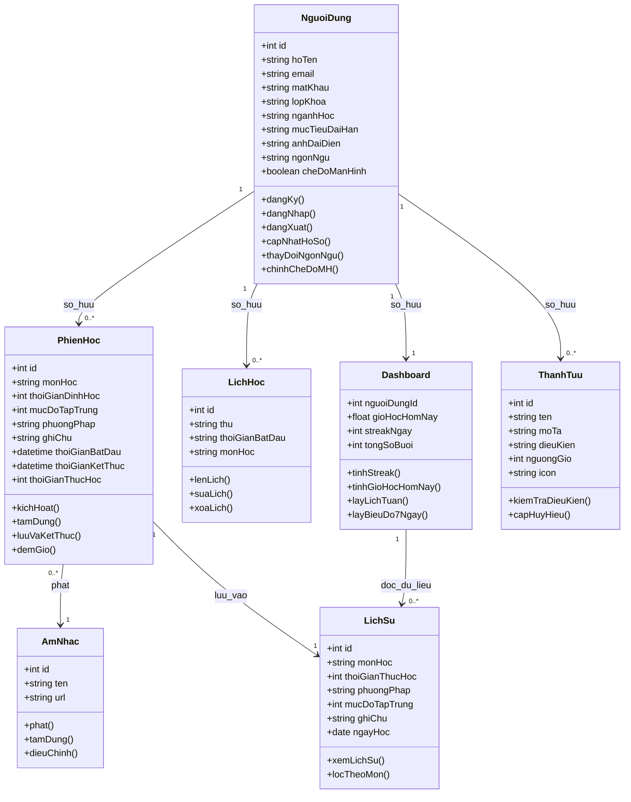

# StudyTrack - Hướng dẫn Dự án

Chào mừng bạn đến với StudyTrack, một ứng dụng web quản lý thói quen học tập. Dự án này sử dụng kiến trúc "Thành phần tệp đơn" (Single-file Component), trong đó giao diện (UI), định dạng (styling) và logic xử lý chủ yếu nằm trong tệp `index.html`.

## Tổng quan Dự án

- **Mục đích**: Một công cụ tăng năng suất cho học sinh, sinh viên để quản lý các phiên học, theo dõi tiến độ qua bảng điều khiển (dashboard) và duy trì chuỗi ngày học tập (streaks).
- **Công nghệ cốt lõi**:
  - **HTML5/CSS3**: Triển khai thuần (vanilla) với Biến CSS (CSS Variables) để hỗ trợ thay đổi giao diện (theme).
  - **JavaScript**: Sử dụng Vanilla ES6+ cho toàn bộ logic ứng dụng.
  - **Chart.js**: Dùng để trực quan hóa thói quen học tập trong 7 ngày qua.
  - **Canvas Confetti**: Hiệu ứng pháo hoa khi đạt được thành tựu.
  - **LocalStorage**: Xử lý lưu trữ dữ liệu (Tài khoản người dùng, nhật ký học tập, lịch trình).

## Các Tính năng Hiện tại

Dựa trên mã nguồn, ứng dụng bao gồm các tính năng chính sau:
- **Quản lý phiên học**: Bộ đếm giờ Pomodoro tùy chỉnh, cho phép chọn môn học, thời gian, mức độ tập trung và phương pháp học. Tích hợp trình phát nhạc lofi nền.
- **Bảng điều khiển (Dashboard)**: Theo dõi tổng số giờ học trong ngày, chuỗi ngày học liên tiếp (streak) và tổng số buổi học.
- **Thống kê trực quan**: Biểu đồ cột thể hiện thời gian học tập trong 7 ngày gần nhất sử dụng Chart.js.
- **Lập lịch học tập**: Cho phép người dùng lên lịch học cho từng thứ trong tuần và hiển thị dưới dạng lịch trình.
- **Hệ thống Huy hiệu (Badges)**: Mở khóa các thành tựu (Tân binh, Chiến thần, Bậc thầy) dựa trên tổng thời gian và số buổi học.
- **Hồ sơ Sinh viên**: Quản lý thông tin cá nhân (Tên, Lớp, Ngành, Mục tiêu) và tự động tạo Thẻ sinh viên ảo.
- **Đa ngôn ngữ & Giao diện**: Hỗ trợ chuyển đổi Tiếng Việt/Tiếng Anh và chế độ Sáng/Tối.
- **Xác thực người dùng**: Hệ thống Đăng ký/Đăng nhập cơ bản lưu trữ thông tin cục bộ.

## Cấu trúc Dự án

- `index.html`: Điểm truy cập chính chứa toàn bộ HTML, CSS và JavaScript.
- `dom.mp3`: Tệp âm thanh nền được sử dụng cho các phiên tập trung.
- `README.md`: Tổng quan cơ bản về dự án và các liên kết.
- `main.css` & `main.js`: Hiện tại là các tệp trống (lựa chọn kiến trúc ưu tiên gộp vào `index.html`).

## Xây dựng và Khởi chạy

### Chạy tại máy cục bộ (Local)
1. Chỉ cần mở tệp `index.html` bằng một trình duyệt web hiện đại.
2. Để có trải nghiệm tốt nhất (đảm bảo âm thanh và các tài nguyên tải đúng cách), hãy sử dụng một máy chủ cục bộ như:
   - Tiện ích mở rộng "Live Server" trên VS Code.
   - Python: `python3 -m http.server 8000`.
   - Node.js: `npx serve .`.

### Thư viện phụ thuộc (Dependencies)
Dự án sử dụng các CDN sau:
- [Chart.js](https://cdn.jsdelivr.net/npm/chart.js)
- [Canvas Confetti](https://cdn.jsdelivr.net/npm/canvas-confetti@1.6.0/dist/confetti.browser.min.js)
- Google Fonts (Poppins)

## Quy ước Phát triển

### Kiến trúc Tệp đơn (Single-File Architecture)
Duy trì cách tiếp cận "Tệp đơn" trong `index.html` trừ khi có yêu cầu cấu trúc lại (refactor). Logic được chia thành các phần:
- `<style>`: Các biến giao diện và định dạng thành phần.
- `<body>`: Cấu trúc UI được chia thành các thẻ div `content-section`.
- `<script>`:
  - `langData`: Từ điển hỗ trợ đa ngôn ngữ (VI/EN).
  - Quản lý trạng thái (`isLoggedIn`, `currentUser`).
  - Logic bộ đếm giờ (Timer) và Âm thanh.
  - Tích hợp Chart.js.

### Chiến lược Lưu trữ (Persistence Strategy)
Tất cả dữ liệu được lưu trong `localStorage` với tiền tố `track_`:
- `track_isLoggedIn`: Kiểu Boolean.
- `track_currentUser`: Đối tượng JSON của phiên làm việc hiện tại.
- `track_userDatabase`: Mảng chứa tất cả người dùng đã đăng ký.
- `track_theme`: `light` hoặc `dark`.
- `track_lang`: `vi` hoặc `en`.

### Đa ngôn ngữ (Localization)
Khi thêm các thành phần UI mới, hãy đảm bảo cập nhật đối tượng `langData` trong phần script và sử dụng hàm `applyLanguagePack()` để duy trì hỗ trợ song ngữ.

### Hỗ trợ Giao diện (Theme Support)
Sử dụng các biến CSS (được định nghĩa trong `:root`) cho màu sắc. Chuyển đổi giao diện bằng cách thiết lập thuộc tính `data-theme` trên thẻ `<body>`.

---

## Đặc tả Hệ thống (Kiến trúc Mục tiêu)

Dưới đây là đặc tả kỹ thuật chi tiết của hệ thống "StudyTrack". Hãy sử dụng tài liệu này làm ngữ cảnh chính xác để thiết kế cơ sở dữ liệu, viết mã nguồn Frontend (HTML/JS/Tailwind) hoặc Backend (Flask/Python API).

### 1. THÔNG TIN CHUNG (PROJECT CONTEXT)

• Tên dự án: StudyTrack - Hệ thống phân tích thói quen học tập.
• Mô hình kiến trúc: Client-Server.
• Frontend: Single-Page Application (SPA), HTML5, CSS (Tailwind CSS), JS thuần (ES6), Chart.js.
• Backend: Python 3, Flask, SQLAlchemy ORM, Flask-Login.
• Database: MySQL (Sản phẩm) / LocalStorage (Mô phỏng & Đồng bộ Client).

### 2. KIẾN TRÚC DỮ LIỆU (DATABASE & STATE SCHEMA)

```json
{
  "User": {
    "email": "String (PK) (Unique)",
    "pass": "String (Hashed)",
    "name": "String",
    "streak": "Integer (Default: 0)"
  },
  "Profile": {
    "user_email": "String (FK -> User.email) (1-1)",
    "class": "String (Default: '')",
    "major": "String (Default: '')",
    "goal": "String (Default: '')",
    "avatarData": "String (Base64 Image Data)"
  },
  "Log": {
    "id": "Integer (PK) (Auto Increment)",
    "user_email": "String (FK -> User.email) (1-N)",
    "subject": "String",
    "duration": "Integer (Phút thực tế)",
    "plannedDuration": "Integer (Phút dự kiến)",
    "focus": "Integer (Thang điểm 1-10)",
    "method": "String (Pomodoro / Deep Work / Active Recall)",
    "note": "String",
    "date": "String (DD/MM/YYYY)"
  },
  "Schedule": {
    "id": "Integer (PK) (Auto Increment)",
    "user_email": "String (FK -> User.email) (1-N)",
    "day": "String (Thứ 2 -> Chủ nhật)",
    "time": "String (HH:MM SA/CH)",
    "subject": "String"
  }
}
```

### 3. THIẾT KẾ KIẾN TRÚC TĨNH (CLASS UML IN MERMAID)



### 4. LOGIC ĐỘNG VÀ THUẬT TOÁN (DYNAMIC LOGIC & BEHAVIOR)

#### 4.1. Thuật toán xử lý đếm ngược (Countdown Timer & State Mutation)
Khi kích hoạt phiên học:

```javascript
function triggerManualStart(subject, duration, focus, method, note) {
    if (!subject) throw Error("Subject is required");
    
    // Khởi tạo trạng thái phiên hiện tại (In-Memory State)
    currentSession = {
        subject: subject,
        duration: duration, // phút
        focus: focus,
        method: method,
        note: note,
        secondsLeft: duration * 60,
        startTime: Date.now()
    };

    // Khởi chạy vòng lặp Interval 1 giây
    timerInterval = setInterval(() => {
        if (currentSession.secondsLeft > 0) {
            currentSession.secondsLeft--;
            renderDisplay(currentSession.secondsLeft);
        } else {
            stopCountdown(wasInterrupted = false);
        }
    }, 1000);
}
```

**Khi tạm dừng (`pauseTimer`):** `clearInterval(timerInterval)` và chuyển đổi trạng thái giao diện UI sang trạng thái "PAUSED".

**Khi lưu kết quả phiên học (`stopCountdown`):**
1. Tính toán thời gian học thực tế:
   `durationActual = ((plannedDuration * 60) - secondsLeft) / 60` (làm tròn)
2. Nếu `durationActual > 0`: Tạo đối tượng Log mới -> thêm vào mảng.
