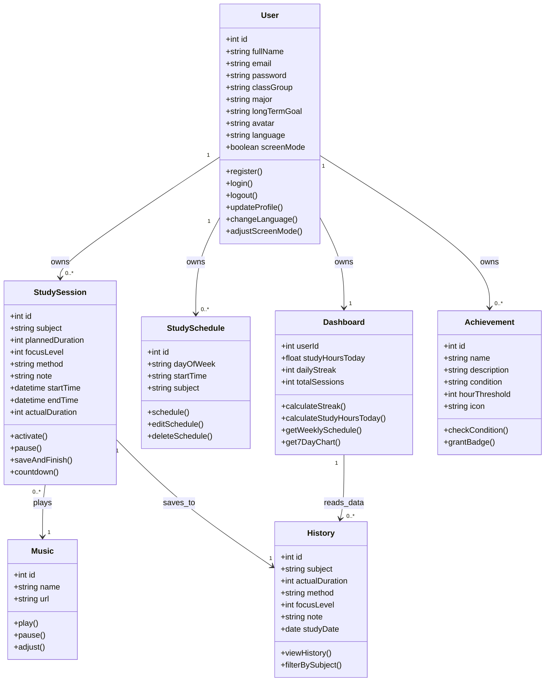

# StudyTrack - Project Instructions

Welcome to StudyTrack, a web-based study habit management application. This project is a "Single-file Component" architecture where UI, styling, and logic are primarily contained within `index.html`.

## Project Overview

- **Purpose**: A productivity tool for students to manage study sessions, track progress via dashboards, and maintain study streaks.
- **Core Technologies**:
  - **HTML5/CSS3**: Vanilla implementation with CSS Variables for theme support.
  - **JavaScript**: Vanilla ES6+ for application logic.
  - **Chart.js**: Used for visualizing study habits over the past 7 days.
  - **Canvas Confetti**: Used for achievement celebrations.
  - **LocalStorage**: Handles all data persistence (User accounts, logs, schedules).

## Current Features

Based on the codebase, the application includes:
- **Study Session Management**: Customizable Pomodoro timer with subject selection, focus levels, and study methods. Integrated lofi background music player.
- **Dashboard**: Real-time tracking of today's study hours, study streaks, and total sessions.
- **Visual Analytics**: Interactive bar charts (via Chart.js) showing study activity over the last 7 days.
- **Weekly Scheduler**: A system to plan study sessions for specific days of the week, displayed in a calendar-like grid.
- **Achievement System**: Badge rewards (Rookie, Focus Warrior, Persistent Master) unlocked based on cumulative study time.
- **Student Profiles**: Personal information management with an automatically generated virtual Student ID Card.
- **Multi-language & Themes**: Seamless switching between Vietnamese/English and Light/Dark modes.
- **Local Authentication**: Basic Register/Login system persisting user data in LocalStorage.

## Project Structure

- `index.html`: The main entry point containing all HTML, CSS, and JavaScript.
- `dom.mp3`: Background audio file used for focus sessions.
- `README.md`: Basic project overview and links.
- `main.css` & `main.js`: Currently empty placeholders (architectural choice favors `index.html`).

## Building and Running

### Running Locally
1. Simply open `index.html` in a modern web browser.
2. For the best experience (and to ensure audio/assets load correctly), use a local server like:
   - VS Code "Live Server" extension.
   - Python: `python3 -m http.server 8000`.
   - Node.js: `npx serve .`.

### Dependencies
The project uses the following CDNs:
- [Chart.js](https://cdn.jsdelivr.net/npm/chart.js)
- [Canvas Confetti](https://cdn.jsdelivr.net/npm/canvas-confetti@1.6.0/dist/confetti.browser.min.js)
- Google Fonts (Poppins)

## Development Conventions

### Single-File Architecture
Maintain the "Single-file" approach in `index.html` unless a refactor is explicitly requested. Logic is separated into sections:
- `<style>`: Theme variables and component styles.
- `<body>`: UI structure divided into `content-section` divs.
- `<script>`:
  - `langData`: Dictionary for Multi-language support (VI/EN).
  - State management (isLoggedIn, currentUser).
  - Timer and Audio logic.
  - Chart.js integration.

### Persistence Strategy
All data is stored in `localStorage` with the prefix `track_`:
- `track_isLoggedIn`: Boolean.
- `track_currentUser`: JSON object of the active session.
- `track_userDatabase`: Array of all registered users.
- `track_theme`: `light` or `dark`.
- `track_lang`: `vi` or `en`.

### Localization
When adding new UI elements, ensure you update the `langData` object in the script section and use the `applyLanguagePack()` function to maintain bilingual support.

### Theme Support
Use CSS variables (defined in `:root`) for colors. Toggle themes by setting the `data-theme` attribute on the `<body>` element.

---

## System Specification (Target Architecture)

The following is the formal specification for the "StudyTrack" system. Use this as the primary context for database design, Backend (Flask/Python), and Frontend (Tailwind CSS) implementation.

### 1. Project Context
- **Name**: StudyTrack - Study Habit Analysis System.
- **Architecture**: Client-Server.
- **Frontend**: Single-Page Application (SPA), HTML5, CSS (Tailwind CSS), Vanilla JS (ES6), Chart.js.
- **Backend**: Python 3, Flask, SQLAlchemy ORM, Flask-Login.
- **Database**: MySQL (Production) / LocalStorage (Simulation & Client Sync).

### 2. Data Schema (ER Schema & Types)

```json
{
  "User": {
    "email": "String (PK) (Unique)",
    "pass": "String (Hashed)",
    "name": "String",
    "streak": "Integer (Default: 0)"
  },
  "Profile": {
    "user_email": "String (FK -> User.email) (1-1)",
    "class": "String (Default: '')",
    "major": "String (Default: '')",
    "goal": "String (Default: '')",
    "avatarData": "String (Base64 Image Data)"
  },
  "Log": {
    "id": "Integer (PK) (Auto Increment)",
    "user_email": "String (FK -> User.email) (1-N)",
    "subject": "String",
    "duration": "Integer (Actual minutes)",
    "plannedDuration": "Integer (Planned minutes)",
    "focus": "Integer (Scale 1-10)",
    "method": "String (Pomodoro / Deep Work / Active Recall)",
    "note": "String",
    "date": "String (DD/MM/YYYY)"
  },
  "Schedule": {
    "id": "Integer (PK) (Auto Increment)",
    "user_email": "String (FK -> User.email) (1-N)",
    "day": "String (Monday -> Sunday)",
    "time": "String (HH:MM AM/PM)",
    "subject": "String"
  }
}
```

### 3. Static Architecture (Class UML)



### 4. Dynamic Logic & Behavior

#### 4.1. Countdown Timer Algorithm & State Mutation
When a study session is activated:

```javascript
function triggerManualStart(subject, duration, focus, method, note) {
    if (!subject) throw Error("Subject is required");
    
    // Initialize current session state (In-Memory State)
    currentSession = {
        subject: subject,
        duration: duration, // minutes
        focus: focus,
        method: method,
        note: note,
        secondsLeft: duration * 60,
        startTime: Date.now()
    };

    // Run 1-second interval loop
    timerInterval = setInterval(() => {
        if (currentSession.secondsLeft > 0) {
            currentSession.secondsLeft--;
            renderDisplay(currentSession.secondsLeft);
        } else {
            stopCountdown(wasInterrupted = false);
        }
    }, 1000);
}
```

**Pause Timer (`pauseTimer`):** `clearInterval(timerInterval)` and toggle UI state to "PAUSED".

**Save Session Result (`stopCountdown`):**
1. Calculate actual duration:
   `actualDuration = ((plannedDuration * 60) - secondsLeft) / 60` (rounded)
2. If `actualDuration > 0`: Create new Log object and add to storage.
