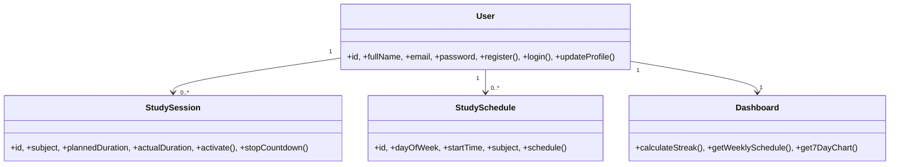

# StudyTrack - Project Instructions

Welcome to StudyTrack, a web-based study habit management application. This project is a "Single-file Component" architecture where UI, styling, and logic are primarily contained within `index.html`.

> **Note — where the active project lives:** the detailed single-file documentation in the rest of this file now describes the **legacy app in `legacy/`** (`legacy/index.html`), kept for reference. The active project is the **full-stack monorepo** (`backend/` FastAPI + Postgres, `frontend/` React/Vite, `deploy/`). For the current architecture, run commands, and Git/deploy flow, start with the root `README.md`, the `## Harness: StudyTrack refactor` section in `CLAUDE.md`, and `make dev` / `make help`. The single-file guidance below is still accurate for `legacy/` but does not describe the new stack.
>
> **Progress:** Phase 0 (scaffold) and **Phase 1 (auth + user foundation: JWT+argon2, User/Profile, virtual student ID, server-synced `lang`/`theme`)** are complete. For the as-built auth architecture see `README.md` ("Xác thực & API") and `CLAUDE.md` ("Active stack — Phase 1").

## Project Overview

- **Purpose**: A productivity tool for students to manage study sessions, track progress via dashboards, and maintain study streaks.
- **Core Technologies**:
  - **HTML5/CSS3**: Vanilla implementation with CSS Variables for theme support.
  - **JavaScript**: Vanilla ES6+ for application logic.
  - **Chart.js**: Used for visualizing study habits over the past 7 days.
  - **Canvas Confetti**: Used for achievement celebrations.
  - **LocalStorage**: Handles all data persistence (User accounts, logs, schedules).

## Current Features

- **Study Session Management**: Customizable Pomodoro timer with subject selection, focus levels, and study methods. Integrated lofi background music player.
- **Dashboard**: Real-time tracking of today's study hours, study streaks, and total sessions.
- **Visual Analytics**: Interactive bar charts (via Chart.js) showing study activity over the last 7 days.
- **Weekly Scheduler**: A system to plan study sessions for specific days of the week, displayed in a calendar-like grid.
- **Achievement System**: Badge rewards (Rookie, Focus Warrior, Persistent Master) unlocked based on cumulative study time.
- **Student Profiles**: Personal information management with an automatically generated virtual Student ID Card.
- **Multi-language & Themes**: Seamless switching between Vietnamese/English and Light/Dark modes.
- **Local Authentication**: Basic Register/Login system persisting user data in LocalStorage.

## Architecture & Development Conventions

### Single-File Architecture
Maintain the "Single-file" approach in `index.html`. All `<style>`, markup, and `<script>` logic are inline. `main.css` and `main.js` are intentionally empty; do not move code into them unless a refactor is explicitly requested.

### Routing
The app uses a **hash-based router**:
- `navigateTo(pageId)`: Sets `window.location.hash`.
- `renderSection()`: Listens to `hashchange`, toggles `.content-section` visibility, enforces auth, and triggers UI updates.
- Page ID Convention: A page `{name}` requires a `#{name}-section` div and an optional `#nav-{name}` menu item.

### Event Wiring
**Event wiring is inline `onclick="fn()"`** in the markup, not `addEventListener`. Define handler functions as top-level globals in the `<script>` block.

### State & Persistence
State is held in module-level variables and mirrored to `localStorage` with the prefix `track_`.
- `track_isLoggedIn`: Boolean.
- `track_currentUser`: JSON object of the active user.
- `track_userDatabase`: Array of all registered users.
- `track_theme` / `track_lang`: User preferences.

**`currentUser` Object Shape:**
```js
{ 
  name, email, pass, streak: 0, logs: [], schedules: [],
  profile: { class: '', major: '', goal: '', avatarData: '' } 
}
```
*Note: Passwords are stored in plaintext for this offline demo.*

### Localization (i18n)
All user-facing strings come from `langData`. `applyLanguagePack()` performs **manual, element-by-element assignment** via `innerText`. 
- To add a string: (1) Update `langData` (vi/en), (2) set a stable `id` on the element, (3) add the assignment line in `applyLanguagePack()`.

### Theme Support
Use CSS variables under `:root` and `[data-theme="light"]`. Toggle themes by setting the `data-theme` attribute on `<body>` via `toggleTheme()`.

## Key Functions Map

| Area | Functions |
|------|-----------|
| Routing | `navigateTo()`, `renderSection()` |
| Auth | `handleRegister()`, `handleLogin()`, `handleLogout()` |
| Persistence | `saveState()`, `updateUserInDatabase()` |
| Rendering | `updateUIAndDashboard()`, `renderCalendar()`, `updateBadgeUI()` |
| Timer | `triggerManualStart()`, `startCountdown()`, `stopCountdown()` |
| i18n/Theme | `applyLanguagePack()`, `toggleLanguage()`, `toggleTheme()` |

## Common Workflows

- **Modify State**: After any mutation of `currentUser`, call `updateUserInDatabase()` then `saveState()`, followed by the relevant render function.
- **Add a Button**: Add `onclick="myFn()"` in markup → define `function myFn()` in script → persist changes → re-render.
- **Add a Page**: Add a `#{name}-section` div → add nav `<li>` with `navigateTo('{name}')` → update `langData` and `applyLanguagePack()`.

## Constraints & Guardrails

- **Single-file is intentional**: Keep everything in `index.html`.
- **No Build/Test/Lint**: Do not introduce complex build tools or package managers.
- **CDN Dependent**: Chart.js and Canvas Confetti load from CDNs; the app requires internet.
- **Persistence Helpers**: Always use `updateUserInDatabase()` + `saveState()` to keep the active user and DB array in sync.
- **Always Bilingual & Themed**: Never hardcode display strings or hex colors in new UI.

## Building and Running

### Running Locally
Serve over HTTP (not `file://`) for audio and assets to load correctly:
- Python: `python3 -m http.server 8000`
- Node.js: `npx serve .`

---

## System Specification (Target Architecture)

*Note: This describes the intended/target architecture (Flask/MySQL), which differs from the current vanilla JS implementation.*

### 1. Data Schema

```json
{
  "User": { "email": "String (PK)", "pass": "String (Hashed)", "name": "String", "streak": "Integer" },
  "Profile": { "user_email": "FK", "class": "String", "major": "String", "goal": "String", "avatarData": "String" },
  "Log": { "id": "PK", "user_email": "FK", "subject": "String", "duration": "Int", "focus": "Int", "method": "String", "date": "String" },
  "Schedule": { "id": "PK", "user_email": "FK", "day": "String", "time": "String", "subject": "String" }
}
```

### 2. Static Architecture (Class UML)



### 3. Dynamic Logic (As-Built Timer)

- **Start (`triggerManualStart`):** Sets `totalSecondsLeft = duration * 60`; toggles UI to timer mode; plays lofi audio; calls `startCountdown()`.
- **Tick (`startCountdown`):** 1s `setInterval` decrements `totalSecondsLeft`; calls `stopCountdown(true)` at 0.
- **Stop/Save (`stopCountdown`):** Calculates `actualMinutes` (rounded up if remainder ≥ 30s); `unshift` log to `currentUser.logs`; persists via helpers; navigates to dashboard.
